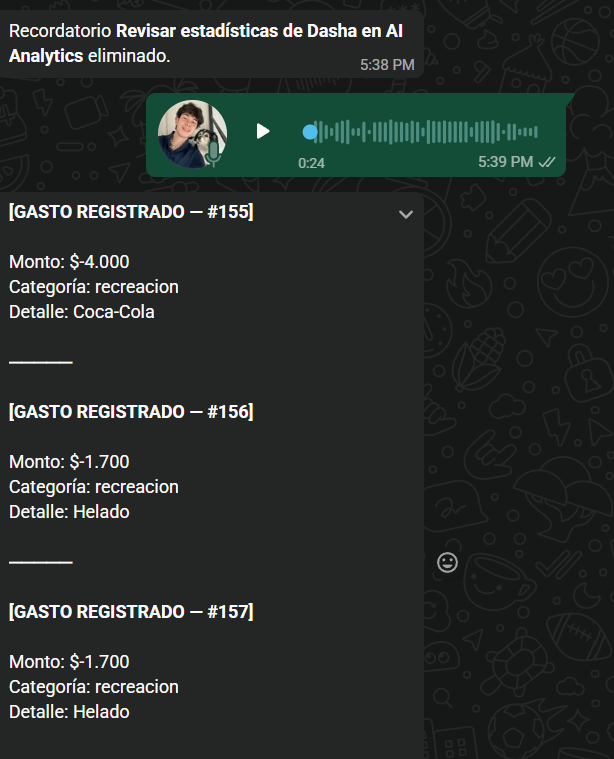
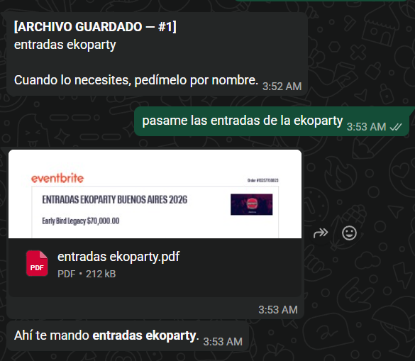
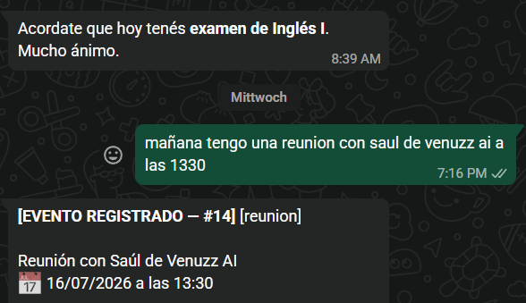

# WhatsApp Expense Tracker

Bot personal de WhatsApp para registrar gastos, deudas, suscripciones, eventos y recordatorios — todo sin salir del chat.

Podés hablarle por texto o mandarle un audio. Entiende lenguaje natural en español rioplatense y guarda todo en una Google Sheet.

---

## Qué puede hacer

**Gastos e ingresos** — registrar, editar, eliminar. Categorías automáticas (comida, transporte, salud, etc.). Soporta pesos y dólares.

**Deudas** — a quién le debés, cuánto pagaste, cuánto falta.

**Suscripciones** — te avisa el día antes del vencimiento. Podés postergar el aviso si todavía no lo pagaste.

**Eventos y turnos** — te recuerda 3 días antes, 1 día antes y el mismo día. Podés configurar a qué hora querés el aviso.

**Recordatorios libres** — "recordame el jueves que tengo que enviar el informe". Podés pedirle que te lo recuerde de nuevo en X horas (snooze).

**Resúmenes** — gastos de hoy, de la semana, del mes. Reporte mensual automático el día 1.

**Archivos** — guardá PDFs e imágenes (tickets, comprobantes, entradas) y pedíselos de vuelta cuando los necesités.

**Audios** — mandás un mensaje de voz y lo transcribe con Whisper. Podés meter varias órdenes en el mismo audio.

---

## Capturas

### Audios con múltiples órdenes
Un solo audio de 24 segundos. El bot lo transcribe y ejecuta todo en orden — tres gastos registrados de una.



---

### Guardar y recuperar archivos
Guardás un PDF o imagen con un nombre, y después lo pedís cuando lo necesitás.



---

### Eventos y recordatorios automáticos
El bot avisa el mismo día del evento. Podés registrar reuniones, exámenes, turnos, etc. con hora y descripción.



---

## Ejemplo de conversación por texto

```
Vos:  gasté 3500 en el super
Bot:  [GASTO REGISTRADO — #142]
      Monto: -$3.500
      Categoría: comida
      Detalle: supermercado

Vos:  en realidad era de social, fui con mi hermana
Bot:  Gasto #142 | comida → social  ¿Confirmás?

Vos:  si
Bot:  Gasto #142 actualizado.
```

---

## Stack

- **Node.js 22** con ESModules
- **Baileys** — cliente WhatsApp (sin API oficial, multi-dispositivo)
- **Claude claude-sonnet-4-6** — interpreta los mensajes y decide qué hacer
- **OpenAI Whisper** — transcripción de audios
- **Google Sheets** — base de datos (simple, editable a mano)
- **Docker** — para deployar en un VPS

---

## Por qué no pagás nada a WhatsApp

Si hoy querés integrar WhatsApp con código de forma oficial, tenés que usar la **WhatsApp Business API de Meta** — que cobra por conversación y requiere aprobación, número de negocio registrado, y cumplir sus políticas. Es la vía que usan bancos y empresas grandes.

Este bot no usa nada de eso. Usa **[Baileys](https://github.com/WhiskeySockets/Baileys)**, una librería open source que reimplementa el protocolo de WhatsApp Web. En la práctica hace exactamente lo mismo que tu navegador cuando abrís `web.whatsapp.com`: escanea el QR, establece una sesión cifrada con los servidores de WhatsApp, y opera como si fuera el cliente web. Para WhatsApp es indistinguible de una persona usando la computadora.

El resultado es que no hay ningún contrato con Meta, ninguna cuenta de negocio, y ningún cargo por mensaje.

**El trade-off:** esto va contra los términos de servicio de WhatsApp. Meta podría bloquear la cuenta. En la práctica apuntan los bloqueos a bots de spam masivo, no a uso personal con bajo volumen — pero es algo a tener en cuenta.

---

## Setup

### 1. Google Sheets

Creá un spreadsheet con estas hojas (pestañas):

`Gastos` · `Ayuda` · `Deudas` · `Suscripciones` · `Eventos` · `Recordatorios` · `Archivos`

Creá un [Service Account en Google Cloud](https://console.cloud.google.com/iam-admin/serviceaccounts), habilitá la Google Sheets API, y compartí el spreadsheet con el email del service account.

### 2. Variables de entorno

```bash
cp .env.example .env
```

Completá los valores. Los obligatorios son `ANTHROPIC_API_KEY`, `GOOGLE_SHEET_ID`, `GOOGLE_SERVICE_ACCOUNT_EMAIL` y `GOOGLE_SERVICE_ACCOUNT_KEY`. `OPENAI_API_KEY` es opcional — solo lo necesitás si querés usar audios.

### 3. Deploy con Docker

```bash
docker-compose build
docker-compose up -d
docker logs <nombre-del-contenedor> -f
```

La primera vez va a mostrar un QR. Escanealo con WhatsApp desde **Dispositivos vinculados**.

La sesión queda guardada en el volumen `app_data`. No hace falta volver a escanear salvo que la borres o la sesión se corrompa.

---

## Estructura

```
src/
  ai/claude.js          — tools y system prompt
  whatsapp/
    client.js           — manejo de mensajes y ejecución de tools
    transcribe.js       — transcripción de audios con Whisper
  sheets/client.js      — lectura y escritura en Google Sheets
  scheduler/            — recordatorios automáticos (eventos, suscripciones, etc.)
  state/conversation.js — historial de conversación y acciones pendientes
  config/index.js       — variables de entorno
```

---

## Notas

- El bot funciona con **una sola cuenta de WhatsApp** a la vez (la que escaneó el QR).
- Los archivos (tickets, comprobantes) que le mandás se guardan en el disco del servidor, no en Sheets.
- Si la sesión se corrompe y aparece "esperando este mensaje" en WhatsApp, borrá el contenido de `data/wa-session/` y volvé a escanear.
